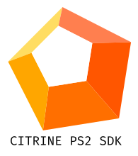

<p align="center">
  
</p>

<h1 align="center">Citrine</h1>

<p align="center">
  <strong>Crystal Virtual Machine, Compiler & Toolkit for Sony PlayStation 2</strong>
</p>

<p align="center">
  <a href="https://github.com/sol-vin/citrine/actions/workflows/ci.yml"></a>
  <a href="https://opensource.org/licenses/MIT"></a>
  <a href="https://crystal-lang.org/">=1.10.0-black?logo=crystal" alt="Crystal" /></a>
  <a href="https://github.com/sol-vin/citrine"></a>
</p>

---

## Overview

**Citrine** brings the expressive elegance, type safety, and developer joy of the **Crystal programming language** to homebrew game development on the **Sony PlayStation 2 (PS2)**.

Rather than wrestling with complex MIPS cross-compilation toolchains, fragile Docker containers, or the intricacies of the Emotion Engine's non-standard R5900 core, Citrine provides:

1. **Citrine-32 Virtual Machine (`citrine-vm`)**: A hardware-tailored virtual machine designed specifically for the Emotion Engine architecture with 32 compact opcodes, 128-bit QWORD register values, and zero-wait-state SPRAM execution.
2. **Native MIPS R5900 JIT & Machine Code Emitter (`Citrine::ElfBuilder`)**: Emits native PlayStation 2 executable ELFs with direct register mapping, peephole instruction fusion, and zero-overhead C runtime bindings.
3. **Raylib-Style Game Engine (`citrine-rt`)**: Simple, productive immediate-mode rendering for the Graphics Synthesizer (GS), DualShock 2 controller polling with analog pressure and rumble, and hardware-accelerated sound.
4. **Hardware Optical Audio Streaming (`S.IRX` & `.cas`)**: Asynchronous double-buffered optical disc streaming running on the IOP coprocessor and SPU2 audio processor for gapless CD-DA background music.
5. **Zero-Dependency Disc Packaging (`Citrine::IsoBuilder`)**: Pure-Crystal ISO9660 disc generator that outputs bootable PS2 discs in milliseconds with no external dependencies like `mkisofs`.
6. **Sub-50ms Compile & Live Hot-Reloading**: Instant compilation, disc creation, and automated boot in PCSX2 or real console hardware via `citrine run --watch`.

---

## Architecture

```
+--------------------------------------------------------------------------+
|                            Crystal Game Code                             |
|             (Raylib-Style API, InputMap, Fibers, Math, Audio)            |
+--------------------------------------------------------------------------+
                                     |
                       [citrine compile / citrine run]
                      (Crystal Parser & AST Lowering)
                                     |
           +-------------------------+-------------------------+
           v                                                   v
   +---------------+                                   +---------------+
   |   game.cbc    | (Citrine-32 Bytecode)             |  game.cbcsym  | (Source Map)
   +---------------+                                   +---------------+
           |                                                   |
           v                                                   |
+---------------------+                                        |
| Citrine::IsoBuilder |                                        |
|  * Pure Crystal     |                                        |
|  * ISO9660 Disc     |                                        |
|  * SYSTEM.CNF       |                                        |
+---------------------+                                        |
           |                                                   |
           v                                                   |
   +---------------+                                           |
   |   game.iso    |                                           |
   +---------------+                                           |
           |                                                   |
   (PCSX2 / Hardware)                                          |
           v                                                   v
+--------------------------------------------------------------------------+
|                      Sony PlayStation 2 Hardware                         |
|                                                                          |
|  [Emotion Engine CPU (MIPS R5900 @ 294.912 MHz)]                         |
|    * Citrine-32 ISA: 32 compact opcodes, 128-byte cache-locked dispatch  |
|    * 128-bit QWORD Values: Single-cycle copies via native lq and sq      |
|    * SPRAM Register Window: $k0 pinned to 0x70000100 (Zero cache miss)   |
|    * 0xDEADBEEF Stack Canary: Hardware register overrun protection       |
|    * 4-Tier Zero-GC Memory: Frame Scratch Pool + Scene Context Arenas    |
|    * Inline MIPS Assembly: First-class asm, COP0 timers, VU0 SIMD        |
|                                                                          |
|  [Graphics Synthesizer (GS @ 147.456 MHz)]                               |
|    * 4 MB internal eDRAM (48 GB/s fillrate)                              |
|    * GIF DMA Packet Engine: 2D primitives, CLUT textures, 3D wireframes  |
|                                                                          |
|  [IOP Coprocessor & SPU2 Sound Subsystem]                                |
|    * S.IRX: Embedded asynchronous optical disc streaming sound driver   |
|    * Double-buffered ping-pong DMA buffers (SPU2 0x15000 / 0x19000)      |
|    * .cas ADPCM streaming container with real-time seeking and volume   |
|                                                                          |
|  [On-Screen Diagnostic HUD & Crash Screen]                               |
|    * Real-time 60 FPS split-meter, CPU/GS time, and SPRAM allocation     |
|    * Styled PS2 BSOD crash handler showing source file, line, and state  |
+--------------------------------------------------------------------------+
                                     ^
                                     | (TCP GDB Port 1234 / 28011)
                       [cradare2 / radare2 Debugger]
```

---

## Why a Custom VM for PlayStation 2?

Running high-level game code at locked 60 FPS on a 294 MHz in-order MIPS processor requires bypassing the severe architectural bottlenecks of the console:

### 1. 128-bit QWORD Values (Single-Cycle Memory)
The Emotion Engine CPU natively processes 128-bit Quadwords. Citrine’s fundamental `Value` is a 16-byte aligned tagged union. Register copies and value transfers execute in a single CPU cycle via the EE's native `lq` (Load Quadword) and `sq` (Store Quadword) instructions.

### 2. SPRAM-Locked Register Window ($k0 @ `0x70000100`)
The EE's L1 Data Cache is only 8 KB (or 16 KB 2-way) and thrashes heavily when game logic and 3D rendering share memory. Citrine completely bypasses L1 D-Cache thrashing by pinning the active **VM register window directly into the 16 KB Scratchpad RAM (SPRAM at `0x70000000`)** with register base pointer `$k0 = 0x70000100`. Virtual register reads and writes operate with **zero wait-states** and zero cache latency.

### 3. Citrine-32 Instruction Set Architecture
Citrine-32 compresses all VM semantics into **32 compact primary opcodes** with 32-bit fixed-width instruction words. The primary dispatch table is only 128 bytes, fitting entirely within **two L1 cache lines**. Hand-scheduled peephole fusions (`BranchCmp`, `LoopDecBr`, `FusedMadd`) combine comparisons and jumps into single-dispatch execution units.

### 4. 4-Tier Deterministic Zero-GC Memory Architecture
Stop-the-world garbage collection pauses cause frame drops and audio hitches. Citrine eliminates GC pauses entirely through a 4-tier hybrid memory model:
- **Tier 1: Per-Frame Scratch Pool (256 KB @ `0x00400000`)**: String interpolations, temporary structs, and vector math buffers are allocated via bump pointer and wiped unconditionally at V-Blank (`Citrine.end_drawing`) in 2 CPU cycles.
- **Tier 2: VM Context Arenas (`make_vm_context(:level)`)**: Scene-specific entities and game states are allocated in isolated memory arenas and wiped in bulk upon scene transitions.
- **Tier 3: Explicit Pointer RAII (`Pointer.malloc` / `Pointer.free`)**: Long-lived textures, VRAM allocations, and audio buffers use deterministic 8-byte aligned lifecycle management.
- **Tier 4: Idle V-Blank Mark-Sweep**: An optional background safety net that runs exclusively during idle VSync intervals when the CPU waits on the Graphics Synthesizer.

### 5. Hardware-Accelerated Optical Audio Streaming (`S.IRX`)
Optical disc drives cannot handle random small seeks while maintaining high transfer rates. Citrine features a dedicated embedded sound driver (`S.IRX`) running on the IOP coprocessor. By double-buffering audio blocks between SPU2 memory addresses `0x15000` and `0x19000` using asynchronous DMA, the engine streams stereo audio up to 96 kbps with zero impact on the EE's 60 FPS graphics pipeline.

---

## CLI Toolkit (`citrine`)

Install the shard or build the CLI executable:

```bash
shards build citrine
```

The compiled binary will be placed at `bin/citrine` (or `bin/citrine.exe` on Windows).

### CLI Command Reference

| Command | Usage | Description |
| :--- | :--- | :--- |
| `citrine ui` / `tui` | `citrine ui` | Launch the interactive Opal Terminal Dashboard for managing projects, builds, disassemblies, and tests |
| `citrine compile` | `citrine compile <file.cr> [-o <out.cbc>] [--release]` | Compile Crystal source into Citrine ByteCode (`.cbc`) and source maps (`.cbcsym`) |
| `citrine iso` | `citrine iso <file.cr \| file.cbc> [-o game.iso] [--release]` | Package compiled bytecode and assets into a bootable PlayStation 2 ISO9660 disc image |
| `citrine run` | `citrine run [file.cr \| file.cbc \| game.iso] [options]` | Compile source, generate ISO, and boot in PCSX2 with live log streaming |
| `citrine debug` | `citrine debug <file.cbc> [--port <port>]` | Launch an interactive radare2 debugging session connected to the PCSX2 GDB stub |
| `citrine mem-check` | `citrine mem-check [file] [--gdb <port>] [--timeout <s>] [--r2]` | Audit memory leaks, SPRAM canary integrity, and crash states via supervised execution |
| `citrine test` | `citrine test [spec_path \| iso]` | Run the automated test suite, bytecode verifications, and headless PCSX2 hardware tests |
| `citrine import` | `citrine import <type> <file> [options]` | Transcode and optimize media via Fluorite and FFmpeg (`video`, `audio`, `cdda`, `texture`, `auto`) |
| `citrine disasm` | `citrine disasm <file.cbc>` | Disassemble bytecode into human-readable assembly with source maps and symbol annotations |
| `citrine monitor` | `citrine monitor [--port <port>]` | Connect live telemetry monitor to PS2 / PCSX2 GDB stub for real-time memory inspection |
| `citrine new` | `citrine new <project_name>` | Scaffold a new Citrine PS2 project structure with templates, config, and assets |
| `citrine version` | `citrine version` | Display the Citrine toolkit version and target environment information |

### Key `citrine run` Options
- `--watch`: Watch Crystal source files and asset directories, automatically recompiling and hot-reloading the game on save.
- `--batch`: Run PCSX2 in headless batch mode for automated test suites and continuous integration.
- `--host`: Run in the local desktop host simulator (`citrine_host_runner.exe`).

### Key `citrine import` Subcommands
- `citrine import video cutscene.mp4 --fps 15 --resolution 512x448`: Convert video to PS2 IPU MPEG-2 Program Stream (`.pss`).
- `citrine import audio track.wav`: Convert audio to Sony SPU2 4-bit ADPCM (`.vag`) or streamed ADPCM container (`.cas`).
- `citrine import cdda album.wav`: Transcode audio into Red Book CD-DA raw sector streams (2352 bytes/sector).
- `citrine import texture sprite.png`: Convert images to GS CLUT paletted textures (`.cbt`).
- `citrine import auto ./assets -o ./build`: Batch-transcode an entire folder of game assets.

---

## Writing Games in Crystal

Here is a complete game demonstrating the Raylib-style API, DualShock 2 controller input, 2D rendering, and audio:

```crystal
require "citrine"

# Initialize 640x448 NTSC display framebuffer
Citrine.init_window(640, 448, "My PS2 Game")
Citrine.set_target_fps(60)

# Load background music stream and sound effect
Citrine.audio_stream_open("cdrom0:\\TRACK01.CAS;1")
Citrine.audio_stream_play

pos = Vector2.new(320.0, 224.0)
speed = 4.0

Citrine.main_loop do
  # DualShock 2 D-Pad & Analog Stick Input
  if Citrine.button_down?(Button::Right)
    pos.x += speed
  elsif Citrine.button_down?(Button::Left)
    pos.x -= speed
  end

  if Citrine.button_down?(Button::Down)
    pos.y += speed
  elsif Citrine.button_down?(Button::Up)
    pos.y -= speed
  end

  # Rendering Pass
  Citrine.begin_drawing
  Citrine.clear_background(Color::Black)

  # Draw 2D primitives and text
  Citrine.draw_rectangle(pos.x, pos.y, 48, 48, Color::Red)
  Citrine.draw_circle(pos.x + 24.0, pos.y + 24.0, 12.0, Color::Yellow)
  Citrine.draw_text("Hello from Crystal on PlayStation 2!", 30, 30, 18, Color::White)

  Citrine.end_drawing
end

Citrine.close_window
```

---

## Modular Subsystems & Require-Driven Context DSL

On PlayStation 2's **32 MB Main RAM** and tight instruction cache architecture, keeping every native subsystem and scene entity loaded at all times causes memory exhaustion. Citrine provides a **Require-Driven Context Architecture**:

```crystal
require "citrine" # Resident Kernel (~180 KB: VM, DualShock, SIF/DMA, Math)

# Group modular subsystems and user files by execution context:
context(:menu) do
  require "citrine/draw2d"
  require "./src/menu/title_screen"
end

context(:game) do
  require "citrine/draw3d"
  require "citrine/physics"
  require "./src/game/player"
  require "./src/game/dungeon"
end

# Shared across multiple contexts:
@[Context(:menu, :game)]
require "citrine/audio"

# Top-level state-machine loop with zero-fragmentation context memory shifts
loop do
  # 1. 2D Title Screen & Menus
  menu = TitleScreen.new
  Citrine.main_loop(context: :menu) do
    menu.draw
    exit if menu.start_selected?
  end

  # === Context Shift: DMA sync + context_arena.offset = 0 (100% RAM reclaimed) ===

  # 2. 3D Gameplay
  player = Player.new
  dungeon = Dungeon.new
  Citrine.main_loop(context: :game) do
    player.update
    dungeon.draw
    exit if player.dead? || Citrine.button_pressed?(0, :select)
  end
end
```

### Modular Requires Reference

| Require Path | Subsystem | Description & Features |
| :--- | :--- | :--- |
| `require "citrine"` | **Core Resident Kernel** | VM interpreter, zero-GC arenas, DualShock pad, SIF/DMA transport, Vector2, Vector3, Matrix4, Color, `main_loop`, `exit`. (~180 KB). |
| `require "citrine/draw2d"` | **2D Graphics DSL** | Affine transform stack (`Transform2D`), 2D texture drawing DSL (`draw_texture`, origin presets, `flip_x`/`y`, UV cropping), 8-bit CLUT palette swapping (`PSMT8` with CSM1 swizzling), rotated text (`text(..., rotation: deg)`), rounded rectangles (`radius:`), circles, stars, card styling. |

| `require "citrine/draw3d"` | **3D Graphics DSL** | Perspective camera (`Citrine::Draw3D.mode`), cubes, wireframes, floor grids, 3D mesh rendering, lighting. |
| `require "citrine/gl"` | **Immediate-Mode GS** | Low-level GS rasterizer control, primitive blocks (`triangles`, `quads`, `lines`), custom blend equations, eDRAM state. |
| `require "citrine/audio"` | **SPU2 Sound Banks** | SPU2 2MB sound banks, sample lifecycles (`:pinned`, `:cached` LRU, `:transient`), ADPCM voices, CD-DA disc streaming. |
| `require "citrine/video"` | **IPU Video Streaming** | Full-Motion Video (FMV) streaming from disc via hardware IPU MPEG-2 decoder. |
| `require "citrine/physics"` | **Fixed-Point Physics** | Deterministic 16.16 math, AABB & sphere collision, Verlet particle dynamics, rigid bodies. |
| `require "citrine/shader"` | **VU1 Vertex Shaders** | Programmable vertex pipelines compiling to VU1 128-bit dual-issue VLIW microcode. |
| `require "citrine/compute"` | **VU0 Compute Kernels** | Autonomous micro-mode compute kernels for parallel mathematical transforms. |
| `require "citrine/ui"` | **Immediate-Mode UI** | DualShock-navigable UI panels, sliders, buttons, checkboxes, and progress bars. |
| `require "citrine/inputmap"` | **Semantic InputMap** | Controller action bindings, multi-button combo detection, analog stick deadzone smoothing. |
| `require "citrine/scene"` | **Scene Graph** | Scene lifecycle management, cameras, and transition states. |
| `require "citrine/context"` | **Context Manager** | Context state introspection, `active_context`, and dynamic switching API. |

---

## Hardware Safety Guarantees & Budget Auditing

Every time you compile code with `citrine compile` or `citrine run`, the **Hardware Budget Checker** statically audits your code:

```
[Citrine] Compiling main.cr -> game.cbc...
[Citrine] Success: game.cbc generated (618 bytes) in 3.9 ms.

=== PS2 Hardware Resource Audit ===
Total Functions:       1
Peak SPRAM Frame:      58 / 1024 registers (__main__)
Bytecode Size:         618 bytes

Budget Status: PASSED (Hardware limits verified).
```

- **SPRAM Register Budget**: Audits register pressure per function; warns if any routine requests $> 128$ registers, and halts if $> 1024$.
- **VRAM Estimator**: Audits resident texture footprints against the GS 4 MB eDRAM pool (~550 KB resident texture budget).
- **SPRAM Stack Canary (`0xDEADBEEF`)**: Injects runtime sentinel canaries into the register frame boundary to trap stack overruns before memory corruption can occur.
- **Infinite Loop Watchdog**: Traps runaway loops executing $> 5,000,000$ bytecode cycles without yielding to the frame loop.
- **On-Screen Crash Handler (PS2 BSOD)**: If an exception or panic occurs, freezes execution and displays an emergency diagnostic screen with the exact Crystal source file, line number, registers, and stack trace.

---

## Diagnostics & cradare2 Integration

### In-Engine Profiler HUD
Toggle the diagnostic overlay at any time via `Citrine.debug_overlay = true` or by pressing `Button::Select` on the controller:
- **FPS & Frame Pacing**: Real-time 59.94 FPS / 16.6ms frame pacing indicator.
- **EE CPU Split-Meter**: Microsecond breakdown between VM bytecode execution and native C runtime engine routines.
- **GS GPU Rasterization**: eDRAM drawing and rasterization timing.
- **SPRAM Utilization**: Real-time count of active registers out of the 1,024 register window.
- **Frame Arena Footprint**: High-water mark of Tier 1 bump allocations.

### radare2 & cradare2 Debugging
Citrine bridges directly with [`cradare2`](https://github.com/sol-vin/cradare2) and standard radare2:
- **Source Maps (`.cbcsym`)**: Maps every bytecode instruction and emitted MIPS machine instruction back to its originating Crystal file, line number, and AST block.
- **GDB Remote Protocol**: Connects to PCSX2's built-in GDB stub (`127.0.0.1:1234` or custom port) for interactive hardware breakpoints, register inspection, and single-stepping.
- **Automated Memory Audits (`citrine mem-check`)**: Automatically executes headless test runs in PCSX2, parses emulog traces, inspects canary health, and reports any leaks or illegal memory accesses.

---

## Showcase Examples Catalog

Explore the `examples/` directory for ready-to-run showcases:

| Example | Path | Highlights |
| :--- | :--- | :--- |
| **01 Hello World** | [`examples/01_hello_world`](examples/01_hello_world/main.cr) | Frame loop execution, dynamic frame counting, GS 2D primitives, and live blinking badge |
| **02 Shapes & Text** | [`examples/02_shapes_and_text`](examples/02_shapes_and_text/main.cr) | 2D primitives, color palettes, typography rendering, and interactive profiler HUD overlay |
| **03 Entity Fibers** | [`examples/03_entity_fibers`](examples/03_entity_fibers/main.cr) | Entity AI patrol logic with cooperative lightweight coroutines/fibers |
| **04 Safety & Panic** | [`examples/04_safety_and_panic`](examples/04_safety_and_panic/main.cr) | Hardware safety guards, SPRAM stack canary auditing, and on-screen crash handler (PS2 BSOD) |
| **05 Hello World (InputMap)** | [`examples/05_hello_world`](examples/05_hello_world/main.cr) | Classic DVD-style bouncing logo benchmark with Godot-style InputMap and RNG |
| **06 DVD Bounce** | [`examples/06_dvd_bounce`](examples/06_dvd_bounce/main.cr) | High-performance multi-logo DVD bounce stress test pushing GS primitive rasterization |
| **07 Primitives 2D/3D** | [`examples/07_primitives_2d_3d`](examples/07_primitives_2d_3d/main.cr) | Combined 2D rasterization, textured quads, and 3D wireframe rendering |
| **08 Controller Tester** | [`examples/08_controller_tester`](examples/08_controller_tester/main.cr) | Full DualShock 2 hardware diagnostic suite (pressure buttons, analog sticks, vibration rumble motors) |
| **09 Concurrency Showcase** | [`examples/09_concurrency_showcase`](examples/09_concurrency_showcase/main.cr) | CSP channels, wait groups, and fiber scheduling on the Emotion Engine |
| **10 CD Player** | [`examples/10_cd_player`](examples/10_cd_player/main.cr) | Night Tempo - Moonrise CD-DA multi-track optical playback and double-buffered SPU2 audio streaming |
| **11 Macro ECS Showcase** | [`examples/11_macro_ecs_showcase`](examples/11_macro_ecs_showcase/main.cr) | High-performance macro-driven Entity Component System tailored for 32 MB console memory |
| **12 Immediate UI** | [`examples/12_immediate_ui`](examples/12_immediate_ui/main.cr) | Immediate-mode GUI controls, sliders, toggle switches, and button widgets |
| **13 Physics & Particles** | [`examples/13_physics_and_particles`](examples/13_physics_and_particles/main.cr) | Particle systems, emitter physics, and 2D kinematics integration |
| **14 Creative Coding** | [`examples/14_creative_coding`](examples/14_creative_coding/main.cr) | Procedural generative art, geometric pattern generators, and mathematical visualizations |
| **15 Rigid Body Physics** | [`examples/15_rigid_body_physics`](examples/15_rigid_body_physics/main.cr) | 3D rigid body dynamics, bounding box collisions, and impulse physics |
| **16 Shaders & Post-FX** | [`examples/16_shaders_and_postfx`](examples/16_shaders_and_postfx/main.cr) | GS rasterization effects, color filtering, and post-processing passes |
| **17 Inline Assembly** | [`examples/17_inline_assembly`](examples/17_inline_assembly/main.cr) | First-class MIPS R5900 inline assembly (`asm`), COP0 cycle counter profiling, and VU0 SIMD |

---

## Testing & Quality Assurance

Run the complete automated test suite:

```bash
# Run all unit tests, compiler specs, and MIPS emitter tests
crystal spec

# Or use the Citrine CLI test runner
citrine test
```

### Automated PCSX2 Hardware Tests
To execute end-to-end hardware tests in PCSX2:

```bash
citrine test spec/ps2/
```

This compiles test targets, generates disc images via `Citrine::IsoBuilder`, launches PCSX2 headlessly, attaches programmatic debuggers, and asserts real console behavioral correctness.

---

## Contributing

Contributions are welcome! Please submit issues, fork the repository, and open pull requests.

1. Fork the Project
2. Create your Feature Branch (`git checkout -b feature/AmazingFeature`)
3. Commit your Changes (`git commit -m 'Add some AmazingFeature'`)
4. Push to the Branch (`git push origin feature/AmazingFeature`)
5. Open a Pull Request

---

## License

This project is licensed under the MIT License - see the [LICENSE](LICENSE) file for details.
