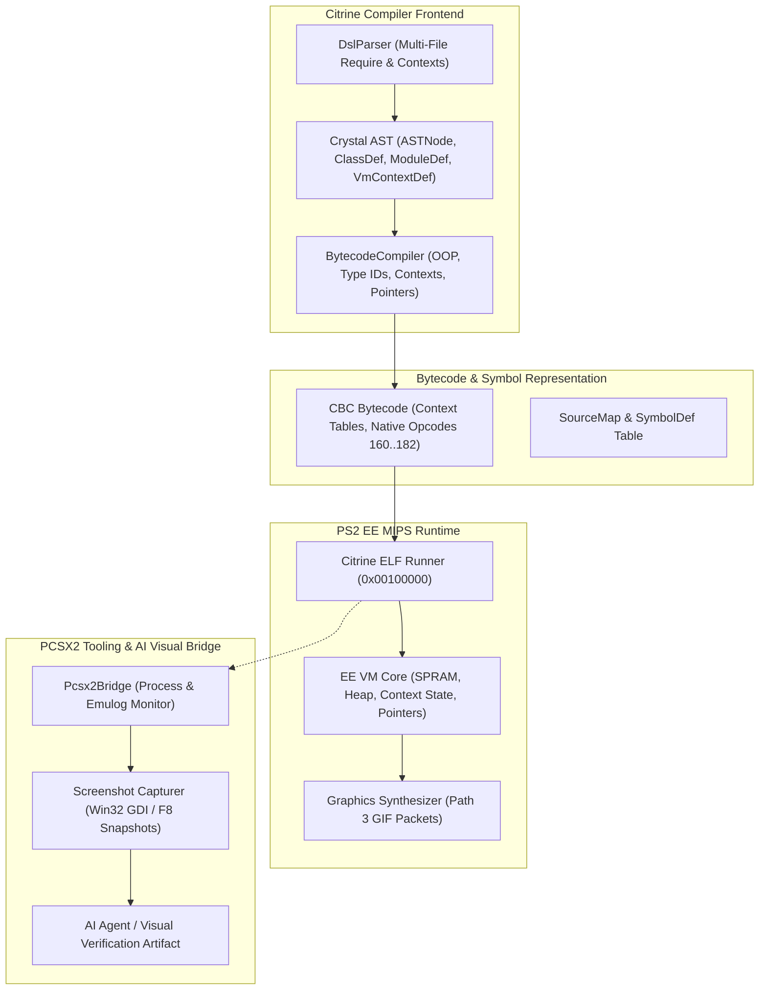

# Implementation Plan: PCSX2 Screenshot Capture, VM Contexts, Multi-File Requires, Advanced Crystal OOP & Pointer/Box Primitives

This plan outlines the architecture, compiler additions, runtime primitives, and automated test harness to fulfill the user's requirements:
1. **PCSX2 Screenshot Capture in Debugger Bridge**: Programmatic capture of PS2 video output so the AI agent and test harness can inspect real visual rendering and diagnose graphics glitches.
2. **VM Context & Require Management**: Modular partitioning of libraries via `make_vm_context`, `set_vm_context`, and `vm_context`, enabling dynamic loading/unloading of contexts (e.g. `:menu` vs `:game`) to preserve PS2 EE RAM.
3. **Multi-File Requires**: Recursive local file imports (`require "./myfile.cr"`), canonical path resolution, and circular dependency tracking.
4. **Crystal OOP & Type System Expansion**:
   - `include` and `extend` for mixins.
   - Type inspection and casting: `.is_a?(Type)` and `.as(Type)`.
   - Modifiers: `abstract class`, `abstract def`, `property`, `getter`, `setter`, `class_property`, `class_getter`, `class_setter`, visibility (`private`, `protected`).
   - Union types: `Int32 | Float32 | SomeClass` in method signatures and type checks.
5. **Low-Level Memory & Interop Primitives**: `Pointer(T)`, `Pointer.malloc`, `ptr.value`, `ptr[idx]`, `ptr.address`, direct address wrapping (`Pointer(UInt32).new(0x70000000)` for SPRAM/registers), and `Box(T).box` / `Box(T).unbox`.

---

## Architecture Overview



---

## User Review Required

> [!IMPORTANT]
> **Context Isolation Semantics**:
> `make_vm_context(:name) do ... end` isolates definitions and `require`s to that specific context. Code within `vm_context(:name) do ... end` executes with that context active. In bytecode, functions are tagged with their enclosing context ID, and calling a function outside the active context triggers a compile-time warning or a runtime context switch opcode.

> [!TIP]
> **Pointer Primitives on PS2**:
> `Pointer(T).new(address)` allows direct raw access to PS2 Scratchpad RAM (`0x70000000`) and EE I/O registers without crossing C FFI boundaries, making high-performance buffer manipulation zero-cost.

---

## Proposed Changes

### Component 1: PCSX2 Screenshot Capture in Debugger Bridge

#### [MODIFY] `src/citrine/debugger/pcsx2_bridge.cr`
- Add `capture_screenshot(output_path : String) : Bool`:
  - **Method 1 (Direct Win32 GDI Capture)**: Finds the PCSX2 render window (`MainWindowHandle`) and captures the exact client rect to a PNG file using PowerShell/.NET `System.Drawing.Graphics.CopyFromScreen`.
  - **Method 2 (PCSX2 Snapshot Hotkey F8)**: Sends `VK_F8` to the PCSX2 window, waits for the newly created screenshot in `C:\Users\Ian\Documents\PCSX2\snaps\*.png`, and copies it to `output_path`.
- Add `take_screenshot_at(frame : Int32, output_path : String)` helper during supervised test runs.
- Support copying screenshots directly into the Antigravity conversation artifact directory (`C:\Users\Ian\.gemini\antigravity\brain\800ae8f6-80d0-4428-93ad-3dc0043d07e3/`) so that markdown artifacts can embed and visually display emulator output inline.

#### [MODIFY] `src/citrine/spec/ps2_spec.cr`
- Add `tc.capture_screenshot(frame : Int32, name : String)` to `Ps2TestCase`.
- Save screenshot path in `Ps2ExecutionResult#screenshot_path` for visual inspection in test results.

---

### Component 2: Multi-File Require & Dependency Graph

#### [MODIFY] `src/citrine/parser/dsl_parser.cr`
- Enhance `handle_require`:
  - Resolve relative paths (`require "./player.cr"`, `require "./entities/enemy"`, `require "../common/math"`).
  - Canonicalize absolute paths (`File.expand_path` / `Path#normalize`) and store in `program.loaded_requires : Set(String)` to prevent cyclic require loops.
  - Automatically recursively parse child files using `DslParser.new(filename: canonical_path)`.
  - Merge AST definitions (`defs`, `structs`, `modules`, `top_level_nodes`, `vm_contexts`).

---

### Component 3: VM Contexts (`make_vm_context`, `set_vm_context`, `vm_context`)

#### [NEW] `src/citrine/ast/vm_context.cr`
- Define `VmContextDef`:
  ```crystal
  class VmContextDef
    property name : String
    property id : UInt16
    property requires : Set(String)
    property defs : Hash(String, Crystal::Def)
    property structs : Hash(String, Crystal::ClassDef)
    property modules : Hash(String, Crystal::ModuleDef)
    property top_level_nodes : Array(Crystal::ASTNode)
  end
  ```

#### [MODIFY] `src/citrine/parser/dsl_parser.cr`
- In `process_top_level`, recognize calls:
  - `make_vm_context(name_sym_or_str) do ... end`: creates a new `VmContextDef` and routes declarations within the block into that context scope.
  - `set_vm_context(name_sym_or_str)`: top-level call to switch the active context.
  - `vm_context(name_sym_or_str) do ... end`: executes enclosed statements under the named context.

#### [MODIFY] `src/citrine/compiler/bytecode_compiler.cr`
- Add context ID tagging to compiled functions.
- Emit `CallNative` / `Opcode` for context switching (`ContextSwitch`).

---

### Component 4: OOP, Mixins (`include`/`extend`), Typing (`is_a?`/`as`), Modifiers, and Unions

#### [MODIFY] `src/citrine/compiler/bytecode_compiler.cr`
- **`include` and `extend` Support**:
  - In `extract_class_members`:
    - On `include ModuleName`: copy all defs from `ModuleName` into the class's instance method table (`ClassName#method`).
    - On `extend ModuleName`: copy all defs from `ModuleName` into the class's class/singleton method table (`ClassName.method`).
    - Record module ID in `cls_info.included_module_ids : Array(UInt32)`.
- **Inheritance & Ancestry**:
  - Inherit fields and methods from superclass (`class Dog < Animal`).
  - Track ancestor IDs: `[class_id, superclass_id, ...included_module_ids]`.
- **Type Checking & Casting**:
  - `obj.is_a?(TargetClass)`: compares `obj`'s class ID and ancestor IDs against `TargetClass`. Returns `1` or `0`.
  - `obj.as(TargetClass)`: runtime check. If `is_a?(TargetClass)` passes, returns `obj`. Otherwise triggers `TypeCastError`.
- **Modifiers**:
  - `abstract class` and `abstract def`: validated during class member extraction; prevents direct `.new` instantiation of abstract classes.
  - `property`, `getter`, `setter`: full suite for instance variables.
  - `class_property`, `class_getter`, `class_setter`: static/class-level properties with global/class backing storage.
  - Visibility: parse and respect `private`, `protected`, `public`.
- **Union Types**:
  - Accept `Crystal::Union` in method signatures (`arg : Int32 | Float32 | SomeClass`).
  - `obj.is_a?(Type1 | Type2)` evaluates true if `obj` matches any union member.

---

### Component 5: Low-Level Memory Primitives (`Pointer(T)`, `Box(T)`, `malloc`)

#### [MODIFY] `src/citrine/compiler/bytecode_compiler.cr` & `src/citrine/iso/elf_builder.cr`
- Add native opcode IDs:
  - `PointerMalloc = 160`: allocates contiguous byte buffer in heap; returns pointer ID.
  - `PointerGet = 161`: `ptr[index]` / `ptr.value` dereference.
  - `PointerSet = 162`: `ptr[index] = val` / `ptr.value = val`.
  - `PointerOffset = 163`: `ptr + offset` arithmetic.
  - `PointerAddress = 164`: `ptr.address` returns numeric virtual/physical address.
  - `PointerNew = 165`: `Pointer(T).new(address)` wraps an address (e.g. SPRAM `0x70000000`).
  - `BoxNew = 166`: `Box(T).box(obj)` boxes object reference into raw pointer.
  - `BoxUnbox = 167`: `Box(T).unbox(ptr)` extracts object reference from pointer.
  - `TypeIsA = 170`: `.is_a?(Type)` check.
  - `TypeAsCast = 171`: `.as(Type)` cast.
  - `ContextSet = 180`: switch active VM context.

---

## Verification Plan

### Automated Tests
1. **Screenshot Capture Test**:
   - `crystal spec spec/ps2/screenshot_spec.cr`
   - Boots 05_hello_world in PCSX2, captures screenshot at frame 30, verifies PNG header (`\x89PNG`), image dimensions (640x448), and copies image to artifacts directory.
2. **Multi-File Require & VM Context Test**:
   - `crystal spec spec/ps2/multi_file_and_context_spec.cr`
   - Verifies relative requires (`./entities/player.cr`), context definition (`make_vm_context`), context switching (`set_vm_context`), and require isolation.
3. **Advanced OOP, Mixins, and Types Test**:
   - `crystal spec spec/ps2/advanced_oop_spec.cr`
   - Verifies `include`, `extend`, `is_a?`, `as`, `abstract`, `class_property`, and union types.
4. **Pointer & Box Memory Primitives Test**:
   - `crystal spec spec/ps2/pointer_and_box_spec.cr`
   - Verifies `Pointer(Int32).malloc`, `ptr[i]`, pointer arithmetic, `Pointer.new(0x70000000)`, and `Box(T).box` / `unbox`.
5. **Full Regression Suite**:
   - `crystal spec spec/ps2/examples_ps2_spec.cr` (all 16 examples).
   - `crystal spec spec/ps2/crystal_parity_ps2_spec.cr` (all 6 parity specs).
   - `crystal spec spec/ps2/hello_world_dvd_spec.cr`.

### Manual / Visual Verification
- Embed captured PCSX2 screenshot in the walkthrough artifact using markdown `` to visually verify the bouncing DVD logo and text rendering.
